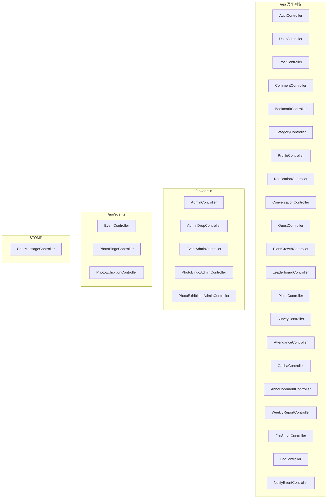

# backend/30-components/controller-structure

> `@RestController` / `@Controller` 30개. HTTP 매핑 어노테이션 합계 **174** (2026-08-31 `rg` 실측).
> 계획서 스냅샷의 199는 코드와 불일치 — **코드가 정본**.

---

## §1. 매핑 분포

| 메서드 | 건수 |
|---|---|
| GET | 83 |
| POST | 41 |
| PUT | 19 |
| DELETE | 16 |
| PATCH | 15 |
| **합계** | **174** |

`ChatMessageController`는 HTTP 매핑이 없고 STOMP `@MessageMapping`만 쓴다.

---

## §2. 패키지별 컨트롤러

<!-- last-verified: 2026-08-31 -->
<!-- code-ref: backend/src/main/java/com/vgc/controller/**/*.java -->

---

## §3. RequestMapping 목록

| 클래스 | prefix |
|---|---|
| `AuthController` | `/api/auth` |
| `UserController` | `/api/users` |
| `PostController` | `/api/posts` |
| `CommentController` | `/api/posts/{postId}/comments` |
| `BookmarkController` | `/api/posts` |
| `CategoryController` | `/api/categories` |
| `ProfileController` | `/api/profile` |
| `NotificationController` | `/api/notifications` |
| `ConversationController` | `/api/conversations` |
| `QuestController` | `/api/quests` |
| `PlantGrowthController` | `/api/plant` |
| `LeaderboardController` | `/api/leaderboard` |
| `PlazaController` | `/api/plaza` |
| `SurveyController` | `/api/surveys` |
| `AttendanceController` | `/api/attendance` |
| `GachaController` | `/api/gacha` |
| `AnnouncementController` | `/api/announcements` |
| `WeeklyReportController` | `/api/weekly-reports` |
| `FileServeController` | `/api/media` |
| `BotController` | `/api/bot` |
| `NotifyEventController` | `/api/notify` |
| `AdminController` | `/api/admin` |
| `AdminDropController` | `/api/admin/drop-transactions` |
| `EventAdminController` | `/api/admin/events` |
| `PhotoBingoAdminController` | `/api/admin/events/{eventId}` |
| `PhotoExhibitionAdminController` | `/api/admin/events/{eventId}/photo-exhibition` |
| `EventController` | `/api/events` |
| `PhotoBingoController` | `/api/events/{eventId}/photo-bingo` |
| `PhotoExhibitionController` | `/api/events/{eventId}/photo-exhibition` |
| `ChatMessageController` | (없음) `/app/chat/{conversationId}` |

경로 권위: 각 파일의 `@RequestMapping`.

---

## §4. NotifyTokenFilter

`/api/notify/**`만 검사한다. Bearer 토큰을 timing-safe 비교하고 `ROLE_NOTIFY_POLLER`를 심는다.

코드: `backend/src/main/java/com/vgc/security/NotifyTokenFilter.java`
등록: `backend/src/main/java/com/vgc/config/SecurityConfig.java`
