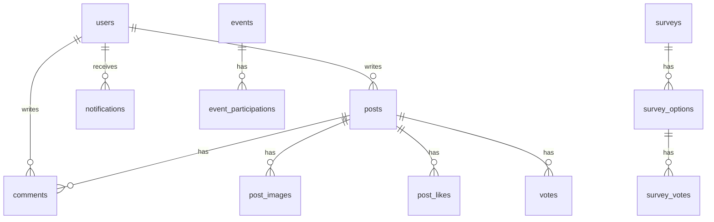
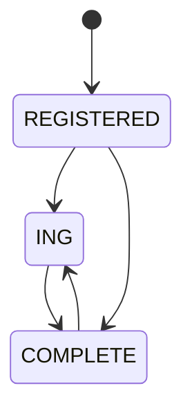

# backend/40-data — MySQL 스키마 · 마이그레이션

> 엔티티 43개. 스키마 생성은 **dev = JPA `ddl-auto=update`**, **prod = JPA `ddl-auto=validate` + 수작업 SQL**.
> `backend/src/main/resources/db/migration/V*.sql` 3개가 있으나 **Flyway 의존성이 `backend/build.gradle`에 없다.** 런타임에 Flyway가 적용되지 않는다.

---

## §1. 현황

| 환경 | Spring profile | ddl-auto | 파일 |
|---|---|---|---|
| dev | `dev` | `update` | `backend/src/main/resources/application-dev.properties` |
| prod | `prod` | `validate` | `backend/src/main/resources/application-prod.properties` |
| (미사용) | `prd` 파일만 존재 | `update` | `backend/src/main/resources/application-prd.properties` — compose가 이 프로필을 쓰지 않음. **삭제하지 말고 무시.** |

compose는 `SPRING_PROFILES_ACTIVE: dev` / `prod`만 주입한다 (`docker-compose.dev.yml`, `docker-compose.prod.yml`).

---

## §2. ER (핵심 관계)

전체 43테이블을 한 그림에 나열하지 않는다. 관계는 표, 분기는 아래 핵심 ER.

<!-- last-verified: 2026-08-31 -->
<!-- code-ref: backend/src/main/java/com/vgc/entity/Post.java, backend/src/main/java/com/vgc/entity/User.java, backend/src/main/java/com/vgc/entity/Comment.java, backend/src/main/java/com/vgc/entity/event/Event.java -->

### 엔티티 → 테이블

| 엔티티 | 테이블 |
|---|---|
| User | `users` |
| Party | `parties` |
| Post | `posts` |
| PostImage | `post_images` |
| PostLike | `post_likes` |
| PostTag | `post_tags` |
| Comment | `comments` |
| Vote | `votes` |
| Bookmark | `bookmarks` |
| Category | `categories` |
| CategoryRequest | `category_requests` |
| Survey | `surveys` |
| SurveyOption | `survey_options` |
| SurveyVote | `survey_votes` |
| SurveyDelivery | `survey_deliveries` |
| Quest | `quests` |
| QuestCompletion | `quest_completions` |
| QuestCompletionLog | `quest_completion_log` |
| AttendanceCheckin | `attendance_checkins` |
| AttendancePhrase | `attendance_phrases` |
| GachaPrize | `gacha_prizes` |
| GachaDraw | `gacha_draws` |
| GachaPityStack | `gacha_pity_stacks` |
| Event | `events` |
| EventParticipation | `event_participations` |
| PhotoBingoCell | `photo_bingo_cells` |
| PhotoBingoSubmission | `photo_bingo_submissions` |
| PhotoExhibitionConfig | `photo_exhibition_configs` |
| PhotoExhibitionSubmission | `photo_exhibition_submissions` |
| PhotoExhibitionImage | `photo_exhibition_images` |
| PhotoExhibitionVote | `photo_exhibition_votes` |
| PhotoExhibitionRewardGrant | `photo_exhibition_reward_grants` |
| Conversation | `conversations` |
| Message | `messages` |
| PlantGrowth | `plant_growth` |
| GrowthScoreLog | `growth_score_log` |
| Notification | `notifications` |
| Announcement | `announcements` |
| WeeklyReport | `weekly_reports` |
| OutboundEvent | `outbound_events` |
| DropTransaction | `drop_transactions` |
| SystemSetting | `system_settings` |
| BirthdayAcknowledgement | `birthday_acknowledgement` |

---

## §3. `db/migration` 에 있는 V*.sql 3개 (Flyway 미기동)

| 파일 | 역할 (파일명) |
|---|---|
| `backend/src/main/resources/db/migration/V2026_04_21__attendance_gacha.sql` | attendance / gacha |
| `backend/src/main/resources/db/migration/V2026_08_05__photo_exhibition.sql` | 사진전 |
| `backend/src/main/resources/db/migration/V2026_08_10__photo_exhibition_voting_started.sql` | 사진전 투표 시작 컬럼 |

`org.springframework.boot:spring-boot-starter-flyway` 없음. 이 파일은 **이력·복붙 재료**이지 자동 적용 경로가 아니다.

---

## §4. 수작업 SQL 14개 — Flyway 미관리

경로: `backend/db-migrations/` (git 추적됨).

| 파일 |
|---|
| `backend/db-migrations/add_attendance_delivery.sql` |
| `backend/db-migrations/add_earned_drops.sql` |
| `backend/db-migrations/add_event_tables.sql` |
| `backend/db-migrations/add_gacha_secret_event.sql` |
| `backend/db-migrations/add_growth_score_log.sql` |
| `backend/db-migrations/add_outbound_events.sql` |
| `backend/db-migrations/add_survey.sql` |
| `backend/db-migrations/add_survey_delivery.sql` |
| `backend/db-migrations/add_survey_requires_shipping.sql` |
| `backend/db-migrations/add_user_shipping.sql` |
| `backend/db-migrations/add_weekly_reports.sql` |
| `backend/db-migrations/birth_month_day_and_registration.sql` |
| `backend/db-migrations/prod_2026_08_05_birth_and_photo_exhibition.sql` |
| `backend/db-migrations/set_quest_has_status.sql` |

prod 반영은 운영자가 이 SQL(또는 `SHOW CREATE TABLE` 복사본)을 **직접** 실행한다.

---

## §5. 스키마 생성 워크플로우

1. **dev:** `@Entity` 변경 → Hibernate `update`가 `vgc_db_dev`에 반영.
2. **prod 준비:** `SHOW CREATE TABLE` / `INFORMATION_SCHEMA.COLUMNS`로 dev 실제 DDL을 복사. 손으로 VARCHAR/DATETIME을 추측하지 않는다.
3. **prod:** 백업 후 SQL 적용 → 백엔드 `ddl-auto=validate`로 기동 확인.

Hibernate 6 함정 (사고 2026-04-27):

- `@Enumerated(EnumType.STRING)` → MySQL `ENUM(...)` (VARCHAR 불가)
- `LocalDateTime` → `DATETIME(6)` (`DATETIME` 불가)

---

## §6. 상태 enum (전이)

### PostStatus

<!-- last-verified: 2026-08-31 -->
<!-- code-ref: backend/src/main/java/com/vgc/entity/PostStatus.java -->

값: `REGISTERED`(등록) · `ING`(진행중) · `COMPLETE`(완료). 작성자가 변경. 5~7단계가 아니다.

### EventStatus

`DRAFT` → `SCHEDULED` → `ACTIVE` → `ENDED` → `SCORED`  
코드: `backend/src/main/java/com/vgc/entity/event/EventStatus.java`  
전이 실행: `backend/src/main/java/com/vgc/service/EventScheduler.java` (매 분 `activateDueEvents` / `endDueEvents`).

### 배송·전달

| enum | 값 |
|---|---|
| `SurveyDeliveryStatus` | PENDING, SHIPPED, DELIVERED, CANCELED |
| `AttendanceDeliveryStatus` | NONE, PENDING, DELIVERED |
