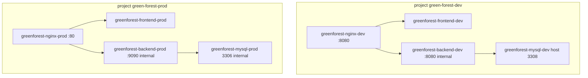

# env/20-containers — Docker Compose · 포트 · 볼륨

> 볼륨 `name:` 은 compose에 고정. 바꾸면 기존 데이터가 끊긴다.
> 계획서의 `vgc_data_dev` / backend `:9090` 노출은 **코드와 불일치**. 아래가 정본.

---

## §1. 구성

<!-- last-verified: 2026-08-31 -->
<!-- code-ref: docker-compose.dev.yml, docker-compose.prod.yml, nginx/nginx.dev.conf, nginx/nginx.prod.conf -->



| 서비스 | 컨테이너 (dev) | 컨테이너 (prod) |
|---|---|---|
| mysql | `greenforest-mysql-dev` | `greenforest-mysql-prod` |
| backend | `greenforest-backend-dev` | `greenforest-backend-prod` |
| frontend | `greenforest-frontend-dev` | `greenforest-frontend-prod` |
| nginx | `greenforest-nginx-dev` | `greenforest-nginx-prod` |

nginx 프록시: dev `http://backend:8080`, prod `http://backend:9090` (`nginx/nginx.dev.conf`, `nginx/nginx.prod.conf`).

backend/frontend는 **호스트에 포트를 열지 않는다.** 외부는 nginx만.

---

## §2. 네트워크 · DNS

| 항목 | 값 |
|---|---|
| 컨테이너 DNS | hostname `mysql` |
| 공개 dev | `https://dev.green-office.uk` |
| 공개 prod | `https://green-office.uk`, `https://www.green-office.uk` |
| 로컬 nginx (dev) | `http://localhost:8080` |

Cloudflare Tunnel 설정 파일은 호스트 `/etc/cloudflared/` (레포 밖).

---

## §3. 볼륨 (변경 금지)

| compose 키 | docker volume name | 용도 |
|---|---|---|
| `mysql_dev_data` | `green-forest_mysql_dev_data` | dev DB |
| `uploads_dev` | `green-forest_uploads_dev` | dev 업로드 |
| `gradle_cache` | `green-forest_gradle_cache_dev` | Gradle 캐시 |
| `mysql_prod_data` | `green-forest-prod_mysql_prod_data` | prod DB |
| `uploads_prod` | `green-forest-prod_uploads_prod` | prod 업로드 |
| `logs_prod` | `green-forest-prod_logs_prod` | prod `/app/logs` |

---

## §4. 환경 파일 주입

```bash
docker compose -p green-forest-dev -f docker-compose.dev.yml --env-file .env.dev up -d
docker compose -p green-forest-prod -f docker-compose.prod.yml --env-file .env.prod up -d
```

compose가 넘기는 변수 예: `DB_PASSWORD`, `JWT_SECRET`, `ADMIN_PASSWORD`, `CORS_ORIGINS`, `NOTIFY_API_TOKEN`. 프론트는 `frontend/.env.dev` / prod build args `NEXT_PUBLIC_API_BASE_URL`, `NEXT_PUBLIC_IMAGE_BASE_URL`.
