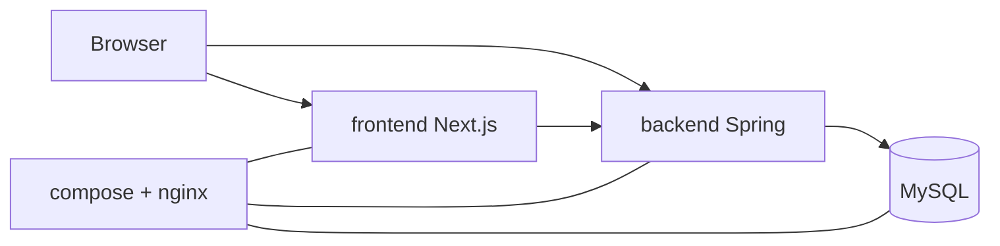

# shared/10-context — 그린 포레스트 전체 경계

> 사내 커뮤니티. 저장소 하나. 환경은 **dev / prod** 두 개.

---

## §1. 대분류 의존

<!-- last-verified: 2026-08-31 -->
<!-- code-ref: docker-compose.dev.yml, docker-compose.prod.yml, frontend/src/lib/api.ts -->

| 대분류 | 코드 | 역할 |
|---|---|---|
| frontend | `frontend/` | UI. REST + STOMP 클라이언트 |
| backend | `backend/` | 비즈니스 · JPA · JWT |
| env (문서) | `docker-compose*.yml`, `nginx/` | 프로세스·포트·볼륨 |
| shared (문서만) | `docs/shared/` | 전역 정책 · ADR |

방향: frontend → backend REST → MySQL. LLM·결제·OAuth 없음.

---

## §2. 운영 환경

| | dev | prod |
|---|---|---|
| 도메인 | `dev.green-office.uk` | `green-office.uk` |
| compose project | `green-forest-dev` | `green-forest-prod` |
| DB | `vgc_db_dev` host `:3308` | `vgc_db` 내부 `:3306` |
